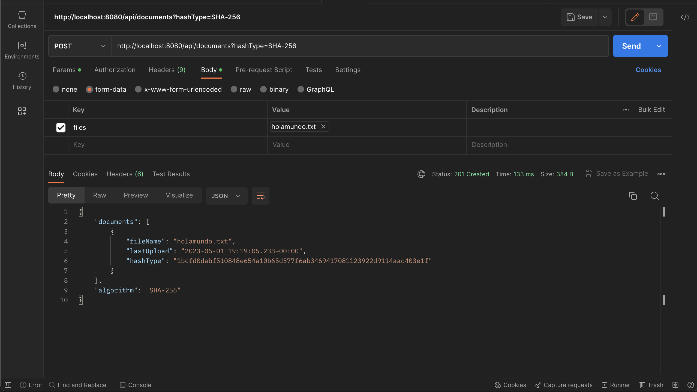

# File Upload API

Este es un proyecto de una API que permite subir, descargar, actualizar y borrar archivos a través de endpoints HTTP. La API utiliza dos algoritmos de hash (SHA-256 y SHA-512) para calcular el hash de los archivos subidos y guardarlos en una base de datos PostgreSQL.

## Tecnologías utilizadas

- Java 8
- Spring Boot 2.5.0
- PostgreSQL 
- JUnit 4
- Swagger

## Funcionalidades

La API proporciona los siguientes endpoints para manejar archivos:

- `POST /api/documents`: Endpoint para subir uno o varios archivos con el tipo de hash especificado. Este endpoint acepta archivos de cualquier tipo.
- `GET /api/documents`: Endpoint para obtener una lista de todos los archivos subidos.
- `GET /api/document`: Endpoint para buscar un archivo por su hash.
- `PUT /api/document`: Endpoint para actualizar un archivo por su hash.
- `DELETE /api/document`: Endpoint para borrar un archivo por su hash.

Para más información sobre el formato de los datos, se puede consultar la documentación de Swagger.

## Documentación

La API utiliza Swagger para generar una documentación interactiva. Para acceder a la documentación, simplemente abra un navegador web y vaya a `http://localhost:8080/swagger-ui.html`.

La documentación proporciona una descripción detallada de cada endpoint, incluyendo los parámetros de entrada, los códigos de respuesta y un ejemplo de respuesta en formato JSON.

## Ejecución en Postman

Pasos para probar el upload en Postman:

1. Abrir Postman y crear una nueva petición POST.
2. En el campo de URL, ingresar `http://localhost:8080/api/documents`.
3. En el panel de Body, seleccionar la opción `form-data`.
4. Agregar un nuevo campo con la key `files` y seleccionar el o los archivos a subir.
5. Se puede agregar en la url el parametro `hashType` poniendo `?hashtype=...`, y especificar el tipo de hash a utilizar sha-256 o sha-512 (si se omite por defecto es sha-256).
6. Click en el botón "Send" para enviar la petición.

## Pruebas unitarias

El proyecto incluye pruebas unitarias escritas con JUnit 4. Para ejecutar las pruebas, se debe seguir los siguientes pasos:

1. En un ide como Intellij Idea, click secundario en el archivo de los tests
2. Si algun test falla, ejecutar de nuevo para que tenga los datos en la bd para probar
